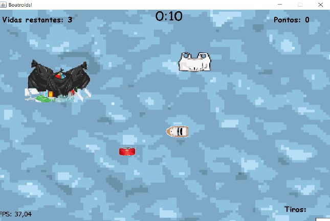
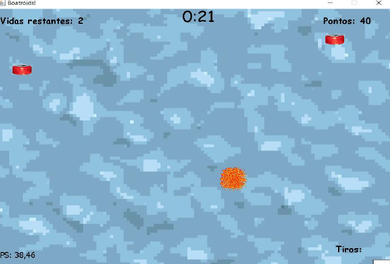
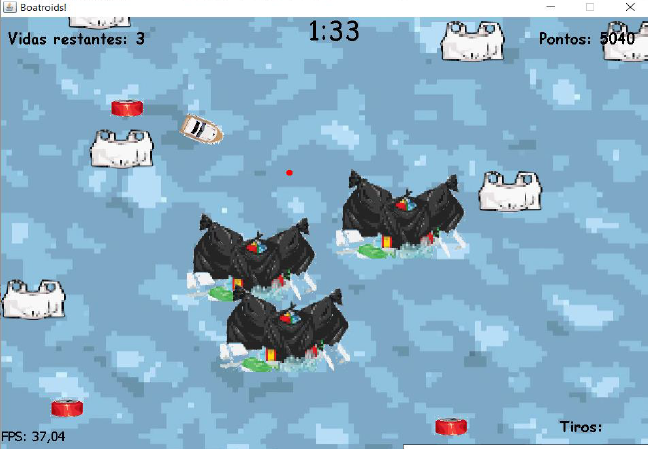

# APS-3-Semestre
## APS desenvolvida no terceiro semestre. O projeto era o desenvolvimento de um jogo em java com interface gráfica.

O trabalho realizado tem como objetivo a apresentação de um jogo que trata de uma importante questão ambiental, ao mesmo tempo que entrega para quem o joga um sólido grau de divertimento.
Tendo em mente ter sido desenvolvido principalmente para crianças, vale ressaltar que as mecânicas de jogo inseridas sempre tiveram o intuito de serem das mais compreensíveis possíveis, procurando evitar complexidade desnecessária que poderia ocasionar falta de entendimento e/ou frustração por parte do usuário.
A criação de um código funcional para o jogo estruturado tem o intuito de colocar os conhecimentos adquiridos durante as fases de pesquisa e também no decorrer deste curso em prática e a teste, afim de enriquecer as habilidades de desenvolvimento dos integrantes e de julgar a capacidade de codificação de um código que realize as funções designada não só com eficácia, mas sim eficiência e precisão, desta forma expandido ainda mais os conhecimentos sobre importantes áreas da computação.
Por meio desse contato em primeira mão do usuário, é esperado uma aprendizagem perceptiva sobre a importância da questão ambiental de lixo nos ambientes hídricos do planeta, com o intuito de pregar uma imagem de preservação, que é uma ação e também comportamento que tem um papel fundamental nos dias de hoje.

### Este trabalho tem uma documentação com 57 páginas! Para ver ela, é so me enviar mensagem!

#### Imagens para mostrar o jogo:

